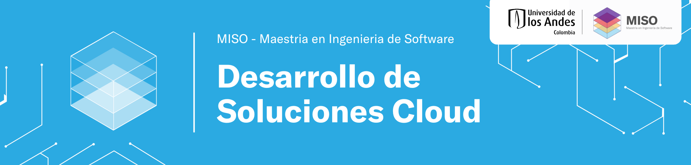

# Desarrollo de Soluciones Cloud — Grupo 11

Este repositorio es el espacio de trabajo del **Grupo 11** para el proyecto del curso **Desarrollo de Soluciones Cloud (MISW4204)**. Aquí deben alojar y desarrollar cada entrega a lo largo del semestre.

## Integrantes

| Nombre | Correo |
|--------|--------|
| German Andres Gonzalez Ortega | ga.gonzalezo1@uniandes.edu.co |
| Laura Pinzon Moreno | l.pinzonm2@uniandes.edu.co |
| Santiago Mora Félix | s.moraf@uniandes.edu.co |
| Sebastian Camilo Pineda Romero | sc.pineda@uniandes.edu.co |

---

## Backend (Go, arquitectura hexagonal)

- **`cmd/api`:** arranque del programa (config, Postgres, Gin).
- **`internal/domain`:** reglas y modelos de negocio (aquí irá el corazón del sistema).
- **`internal/application`:** lógica que orquesta el dominio (ahora solo `Readiness` para comprobar la DB).
- **`internal/adapters/inbound/http`:** rutas HTTP (Gin).
- **`internal/adapters/outbound/postgres`:** conexión real a PostgreSQL.

### Cómo correrlo localmente en tu PC

1. Levanta **solo PostgreSQL**:

   ```bash
   docker compose up postgres
   ```

2. Cuando el contenedor esté *healthy*, en **otra terminal** (desde la raíz del repo):

   ```bash
   go run ./cmd/api
   ```

   Si no defines `DATABASE_URL`, el programa usa por defecto `127.0.0.1:5432` con usuario/clave `app` (igual que en `docker-compose.yml`).

3. Abre en el navegador: [http://localhost:8080/health](http://localhost:8080/health) y [http://localhost:8080/health/ready](http://localhost:8080/health/ready).

El API **siempre** necesita PostgreSQL accesible; si la base no está levantada, el proceso terminará con un mensaje de error al arrancar.

### Comandos útiles

```bash
go mod tidy
go test ./...
go vet ./...
```

### Todo con Docker (API + Postgres)

```bash
docker compose up --build
```

Mismas rutas: `GET /health` y `GET /health/ready`.

Variables: [.env.example](.env.example).


