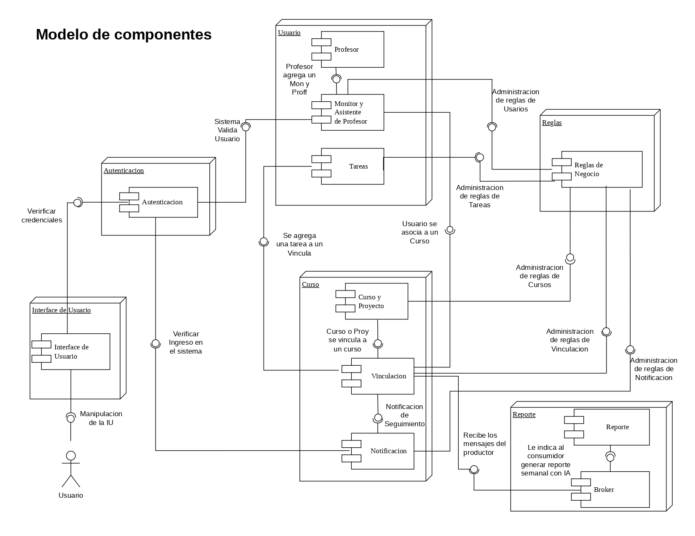
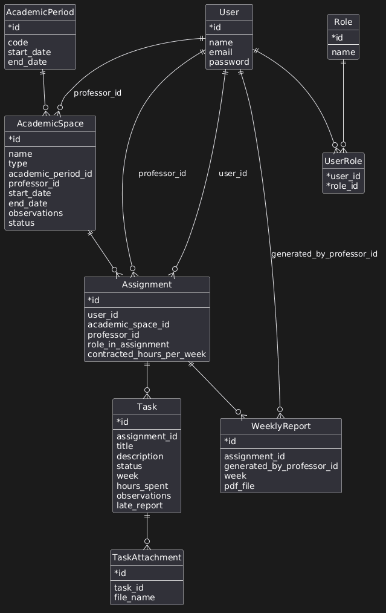

# Documento de arquitectura de solución

## 1. Introducción

Este documento describe la arquitectura de solución propuesta para la plataforma ligera de seguimiento semanal de monitores y asistentes graduados en cursos y proyectos universitarios. Su propósito es explicar de manera clara la estructura general del sistema, sus componentes principales, las decisiones de diseño adoptadas y la forma en que dichas decisiones responden a los requerimientos del proyecto.

La arquitectura aquí presentada está sustentada en los diagramas definidos por el equipo y en la interpretación del dominio descrito en la especificación de la Entrega 1.

## 2. Objetivo de la solución

La solución propone una aplicación web orientada al seguimiento operativo del trabajo semanal realizado por monitores y asistentes graduados. El sistema debe permitir:

- autenticación y control de acceso;
- gestión de usuarios y roles;
- administración de cursos y proyectos;
- gestión de vinculaciones entre profesores, estudiantes y espacios académicos;
- registro semanal de tareas;
- aplicación de reglas de negocio sobre dedicación y seguimiento;
- notificaciones internas;
- generación de reportes semanales en PDF apoyados por IA.

La prioridad arquitectónica es construir un backend consistente, mantenible y alineado con las reglas del dominio, evitando complejidad innecesaria en la interacción de usuario.

## 3. Principios de diseño

La arquitectura de la solución fue definida a partir de los siguientes principios:

- **Separación de responsabilidades**: cada módulo del sistema debe tener una responsabilidad clara.
- **Centralización de reglas de negocio**: las validaciones críticas no deben quedar dispersas entre interfaces o persistencia.
- **Trazabilidad semanal**: el modelo debe representar explícitamente semanas, vinculaciones, tareas y reportes.
- **Escalabilidad funcional**: la solución debe poder crecer de autenticación y usuarios hacia notificaciones y generación de reportes con IA sin rediseñar el sistema por completo.
- **Mantenibilidad**: el diseño debe ser legible, modular y fácil de evolucionar.
- **Desacople de procesos intensivos**: la generación de reportes debe poder separarse del flujo transaccional principal.

## 4. Estructura general del sistema

La solución se organiza en tres vistas complementarias:

- una vista funcional, representada en el modelo de componentes;
- una vista estructural del dominio, representada en el modelo de clases;
- una vista operativa, representada en el modelo de despliegue.

Estas tres vistas permiten comprender la solución desde la distribución de responsabilidades, la organización de la información y la forma en que los componentes interactúan en ejecución.

## 5. Modelo de componentes

### 5.1 Descripción general

El modelo de componentes organiza la solución alrededor de seis bloques principales:

- `Interface de Usuario`
- `Autenticacion`
- `Usuario`
- `Curso`
- `Reglas`
- `Reporte`

Cada uno de estos bloques agrupa capacidades especializadas del sistema.

### 5.2 Componentes principales y responsabilidades

#### Interface de Usuario

Es la capa con la que interactúa el usuario final. Su responsabilidad es presentar la funcionalidad del sistema y permitir la manipulación de la interfaz para ejecutar acciones de negocio. Esta decisión responde al requerimiento de ofrecer una experiencia simple, clara y de baja fricción.

#### Autenticacion

Este componente se encarga de verificar credenciales y habilitar el ingreso al sistema. Constituye la puerta de acceso al resto de capacidades y responde directamente a los requerimientos de autenticación local y control de acceso por rol.

#### Usuario

Este bloque reúne funcionalidades asociadas a los actores principales del sistema y contiene:

- `Profesor`
- `Monitor y Asistente de Profesor`
- `Tareas`

La organización de estos componentes refleja que la plataforma está centrada en personas y en el seguimiento de su trabajo semanal, no en una administración compleja de proyectos.

#### Curso

Este bloque agrupa:

- `Curso y Proyecto`
- `Vinculacion`
- `Notificacion`

La decisión de reunir estos componentes en un mismo módulo responde a que el curso o proyecto es el contexto de trabajo, mientras que la vinculación modela la relación entre el usuario operativo, el profesor y el espacio académico. La notificación se integra aquí porque el seguimiento depende de esa relación y de su temporalidad.

#### Reglas

Este bloque contiene `Reglas de Negocio` y administra la lógica asociada a:

- usuarios;
- tareas;
- cursos;
- vinculaciones;
- notificaciones.

Su existencia como componente explícito responde a la necesidad de implementar validaciones obligatorias y bloqueantes, especialmente aquellas relacionadas con horas contratadas, restricciones de visibilidad y seguimiento semanal.

#### Reporte

Este bloque contiene:

- `Reporte`
- `Broker`

La inclusión de estos componentes responde al requerimiento de generar reportes semanales en PDF a partir de la información registrada, usando un proceso desacoplado que permita incorporar IA generativa sin afectar el flujo principal del sistema.

### 5.3 Relaciones principales del modelo de componentes

El modelo muestra relaciones relevantes entre componentes:

- el usuario interactúa con la `Interface de Usuario`;
- la interfaz depende de `Autenticacion` para validar el ingreso;
- el sistema valida al usuario antes de habilitar operaciones;
- el profesor agrega y administra monitores y asistentes;
- las tareas se registran sobre una vinculación;
- el usuario se asocia a un curso o proyecto por medio de una vinculación;
- las reglas gobiernan usuarios, tareas, cursos, vinculaciones y notificaciones;
- el módulo de reportes recibe mensajes y genera el reporte semanal con IA.

Estas relaciones reflejan un diseño orientado al dominio y con responsabilidades claramente diferenciadas.

## 6. Modelo de clases

### 6.1 Propósito del modelo

El modelo de clases define la estructura de información del sistema y permite entender cómo se representan las entidades principales del dominio y cómo se relacionan entre sí.

### 6.2 Entidades del dominio

#### AcademicPeriod

Representa el período académico. Incluye:

- `id`
- `code`
- `start_date`
- `end_date`

Esta entidad responde al requerimiento de permitir la creación de cursos y proyectos dentro de períodos académicos definidos y controlados.

#### AcademicSpace

Representa el espacio académico y unifica las categorías `curso` y `proyecto`. Incluye:

- `id`
- `name`
- `type`
- `academic_period_id`
- `professor_id`
- `start_date`
- `end_date`
- `observations`
- `status`

Esta decisión de diseño simplifica el modelo al tratar cursos y proyectos como variantes de un mismo concepto con atributos comunes.

#### User

Representa a la persona dentro del sistema. Incluye:

- `id`
- `name`
- `email`
- `password`

Esta entidad soporta la existencia de profesores, monitores y asistentes graduados bajo una misma identidad base.

#### Role

Define el catálogo de roles disponibles dentro del sistema.

#### UserRole

Modela la relación entre usuario y rol. Esta separación permite soportar múltiples roles por usuario, lo cual responde a la necesidad de que una misma persona pueda desempeñarse en más de una función dentro de la plataforma.

#### Assignment

Representa la vinculación entre una persona, un profesor y un espacio académico. Incluye:

- `id`
- `user_id`
- `academic_space_id`
- `professor_id`
- `role_in_assignment`
- `contracted_hours_per_week`

Esta entidad es el eje del dominio porque articula el seguimiento semanal, las reglas de negocio sobre horas y la relación entre usuarios y espacios.

#### Task

Representa una tarea registrada semanalmente. Incluye:

- `id`
- `assignment_id`
- `title`
- `description`
- `status`
- `week`
- `hours_spent`
- `observations`
- `late_report`

Esta entidad responde al requerimiento de registrar tareas semanales, almacenar horas reportadas, controlar el estado de avance y distinguir reportes tardíos.

#### TaskAttachment

Representa archivos adjuntos asociados a una tarea. Incluye:

- `id`
- `task_id`
- `file_name`

Su presencia responde al requerimiento de permitir evidencia complementaria en el registro semanal.

#### WeeklyReport

Representa un reporte semanal generado para una vinculación. Incluye:

- `id`
- `assignment_id`
- `generated_by_professor_id`
- `week`
- `pdf_file`

Esta entidad conecta el seguimiento semanal con el proceso de generación y almacenamiento de reportes PDF.

### 6.3 Relaciones principales del modelo de clases

El diagrama establece las siguientes relaciones estructurales:

- un `AcademicPeriod` agrupa múltiples `AcademicSpace`;
- un `User` puede ser profesor responsable de uno o varios `AcademicSpace`;
- un `User` puede tener múltiples roles mediante `UserRole`;
- un `AcademicSpace` puede tener múltiples `Assignment`;
- un `User` puede tener múltiples `Assignment`;
- un `Assignment` conecta a un usuario operativo con un profesor dentro de un espacio académico;
- un `Assignment` puede tener múltiples `Task`;
- una `Task` puede tener múltiples `TaskAttachment`;
- un `Assignment` puede tener múltiples `WeeklyReport`;
- un `WeeklyReport` es generado por un profesor.

### 6.4 Justificación del modelo de dominio

El modelo de clases responde directamente a los requerimientos del proyecto porque:

- permite representar cursos y proyectos con una estructura común;
- soporta períodos académicos y restricciones temporales;
- ubica la vinculación como unidad de gestión operacional;
- facilita la aplicación de reglas de negocio sobre horas contratadas;
- permite registrar múltiples tareas por semana;
- incorpora adjuntos;
- habilita generación y persistencia de reportes semanales.

## 7. Modelo de despliegue

### 7.1 Descripción general

El modelo de despliegue muestra cómo se distribuyen los componentes del sistema en ejecución. Los elementos principales representados son:

- `Browser (usuario)`
- `Aplicacion web`
- `API REST`
- `Autenticación`
- `Gestión de usuarios`
- `Gestión de tareas`
- `Cursos y vinculación`
- `Reglas del negocio`
- `Generación de reportes`
- `Bd (usuarios, tareas, cursos)`
- `Archivos generados (reportes en pdf)`
- `Broker de mensajería`
- `Modelo`

### 7.2 Interpretación arquitectónica

El diagrama representa un flujo en el que:

1. el usuario accede al sistema desde un navegador;
2. el navegador consume una aplicación web;
3. la aplicación web interactúa con una API REST;
4. la API REST expone módulos especializados de negocio;
5. la información transaccional se almacena en la base de datos;
6. los reportes generados se almacenan como archivos PDF;
7. la generación de reportes se apoya en un broker de mensajería;
8. el broker se integra con un modelo que produce el contenido del reporte.

### 7.3 Decisiones de diseño derivadas del despliegue

Este modelo de despliegue expresa varias decisiones importantes:

- separación entre cliente y backend;
- organización modular dentro del backend;
- persistencia separada entre datos operativos y documentos generados;
- desacople de la generación de reportes mediante mensajería;
- incorporación de un componente especializado para IA generativa.

Estas decisiones responden a la necesidad de mantener el núcleo operativo del sistema estable y, al mismo tiempo, habilitar capacidades de generación automática de reportes.

## 8. Decisiones arquitectónicas principales

Con base en los diagramas y en los requerimientos del proyecto, las decisiones principales de arquitectura son las siguientes:

- construir la solución como una aplicación web apoyada en una API REST;
- organizar la lógica por módulos funcionales del dominio;
- modelar usuarios, roles, espacios académicos, vinculaciones, tareas y reportes como entidades explícitas;
- centralizar reglas de negocio como un componente especializado;
- usar la vinculación como núcleo del seguimiento operativo;
- representar el trabajo semanal mediante tareas asociadas a una vinculación;
- separar almacenamiento transaccional y almacenamiento documental;
- desacoplar la generación de reportes usando un broker;
- integrar un modelo de IA para la producción del contenido del reporte semanal.

## 9. Cómo la arquitectura responde a los requerimientos del proyecto

La arquitectura propuesta responde a los requerimientos del proyecto de la siguiente manera:

- **Autenticación y acceso**: el componente `Autenticacion` atiende el inicio de sesión y el control de acceso.
- **Gestión de usuarios**: el modelo `User`, `Role` y `UserRole` soporta usuarios con múltiples roles.
- **Gestión de cursos y proyectos**: `AcademicSpace` permite manejar ambos tipos de espacio bajo un modelo común.
- **Períodos académicos**: `AcademicPeriod` permite gobernar la apertura y el cierre de espacios.
- **Vinculaciones**: `Assignment` modela la relación entre profesor, usuario operativo y espacio académico.
- **Reglas de dedicación horaria**: el bloque `Reglas de Negocio` centraliza las validaciones obligatorias.
- **Registro semanal de tareas**: `Task` representa el trabajo reportado por semana.
- **Adjuntos**: `TaskAttachment` permite evidencias asociadas a las tareas.
- **Reportes tardíos**: el atributo `late_report` modela esta condición directamente.
- **Notificaciones internas**: el componente `Notificacion` cubre recordatorios y seguimiento.
- **Reportes semanales con IA**: `WeeklyReport`, `Broker` y `Modelo` soportan la generación desacoplada de reportes PDF.

## 10. Ventajas de la arquitectura propuesta

La arquitectura definida ofrece varias ventajas:

- claridad en la separación de módulos;
- alineación directa con el dominio del problema;
- facilidad para incorporar reglas de negocio complejas;
- soporte natural para crecimiento funcional;
- desacople entre operación principal y generación de reportes;
- capacidad de trazabilidad entre vinculaciones, tareas y reportes;
- base sólida para mantenibilidad y evolución futura.

## 11. Riesgos técnicos a considerar

Aunque la arquitectura propuesta es consistente con el dominio, su implementación exige disciplina para evitar los siguientes riesgos:

- dispersar reglas de negocio fuera del componente definido para ellas;
- duplicar lógica entre cursos, proyectos y vinculaciones;
- acoplar demasiado la generación de reportes al flujo principal de la API;
- no preservar la coherencia entre tareas semanales, reportes tardíos y reportes PDF;
- reducir el modelo de dominio a una estructura demasiado simple y perder capacidad de representar correctamente las restricciones del problema.

## 12. Conclusión

La arquitectura propuesta organiza la solución alrededor de componentes funcionales claros, un modelo de dominio centrado en vinculaciones y seguimiento semanal, y un despliegue que separa cliente, backend, persistencia operativa, almacenamiento documental y generación de reportes con IA. Esta estructura responde de forma coherente a los requerimientos funcionales, no funcionales y de negocio del proyecto, y ofrece una base sólida para el desarrollo de la plataforma dentro del alcance definido para la entrega.
